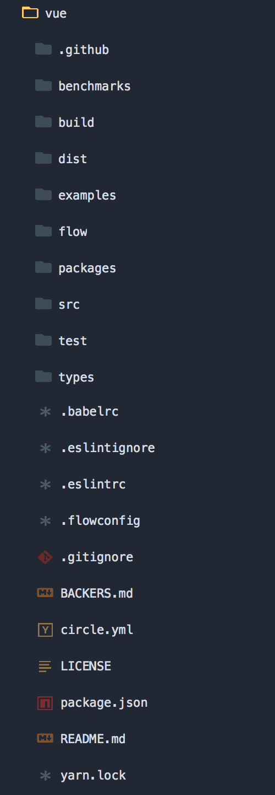

## 入口分析

##### 代码结构:

把Vue的仓库克隆到本地之后,我们切换到```master```分支,会发现大概有类似的目录



下面一起分析下主要目录:

|    目录名称    |                    作用                    |
| :--------: | :--------------------------------------: |
| benchmarks |                  性能测试相关                  |
|   build    |               打包,测试相关配置文件                |
|    dist    |                各版本打包后的文件                 |
|  example   |     [flowtype](https://flow.org/)相关      |
|    src     |                  源码主目录                   |
|    test    |                  单元测试相关                  |
|    type    | 主要存放d.ts文件,[typescript](https://www.typescriptlang.org/)支持 |

分析得到src下面是主要代码目录,我们就从src这边开始分析,这一节主要是分析入口相关部分代码


###### 程序入口:

我们打开```/src/core/instance/index.js```这个文件,可以看到大概有下面这些主要代码:

```		javascript
//	...

//	构造函数
function Vue (options) {
  //  生产环境对无new操作符直接调用Vue的警告
  if (process.env.NODE_ENV !== 'production' &&
    !(this instanceof Vue)) {
    warn('Vue is a constructor and should be called with the `new` keyword')
  }

  //  /src/core/instance/init.js
  this._init(options)
}

//	初始化的入口，各种初始化工作
initMixin(Vue)

//	数据绑定的核心方法，常用的watch等方法
stateMixin(Vue)

//	事件的核心方法，$on，$off，$emit等方法
eventsMixin(Vue)

//	生命周期的核心方法
lifecycleMixin(Vue)

//	渲染的核心方法，用来生成render函数以及VNode
renderMixin(Vue)

//	在最后export上面定义的构造函数给外部使用
/*
	import Vue from "vue";
	
	new Vue({
      //  ...
	})
*/	
export default Vue
```

在Vue这个构造函数下面,调用了```initMixin```,```stateMixin```, ```eventsMixin```,```lifecycleMixin```,```renderMixin```这几个方法对prototype下面绑定相关方法,比如构造函数里面的```this._init(options)```,这个```_init```方法是在```initMixin```这个函数中被加到```Vue.prototype```下的,下面一起来看下这个函数的实现,代码位置在```/src/core/instance/init.js```里面


###### initMixin实现:

```javascript
//	Vue: Class<Component> -> flowtype的写法,静态类型检测
export function initMixin (Vue: Class<Component>) {
  
  //  构造函数下面挂载_init方法,options可传可不传,但是传了就是一个对象类型
  Vue.prototype._init = function (options?: Object) {
    const vm: Component = this
    
    //  生成随机id
    vm._uid = uid++

    let startTag, endTag

    //  Vue2.2+新增的一个关于性能的东西(window.performance)
    //  https://developer.mozilla.org/zh-CN/docs/Web/API/Window/performance
    if (process.env.NODE_ENV !== 'production' && config.performance && mark) {
      startTag = `vue-perf-init:${vm._uid}`
      endTag = `vue-perf-end:${vm._uid}`
      mark(startTag)
    }

    // 避免被观察的flag
    vm._isVue = true

    // 合并配置项
    if (options && options._isComponent) {
      // 内部的组件配置项并不需要特殊处理
      // 具体实现分析在下面
      initInternalComponent(vm, options)
    } else {
      // 合并配置文件到$options
      vm.$options = mergeOptions(
        resolveConstructorOptions(vm.constructor),
        options || {},
        vm
      )
    }
    /* istanbul ignore else */
    if (process.env.NODE_ENV !== 'production') {
      initProxy(vm)
    } else {
      vm._renderProxy = vm
    }
    // expose real self
    vm._self = vm
    
    //	初始化生命周期
    initLifecycle(vm)
    
    //	初始化事件
    initEvents(vm)
    
    //	初始化渲染
    initRender(vm)
    
    //	调用beforeCreate的生命周期钩子
    callHook(vm, 'beforeCreate')
    
    initInjections(vm)
    
    //	初始化组件state
    initState(vm)
    initProvide(vm)
    
    //	调用beforeCreate的生命周期钩子
    callHook(vm, 'created')

    if (process.env.NODE_ENV !== 'production' && config.performance && mark) {
      vm._name = formatComponentName(vm, false)
      mark(endTag)
      measure(`${vm._name} init`, startTag, endTag)
    }

    //	如果options里面传入了el(根组件),就直接启动
    if (vm.$options.el) {
      vm.$mount(vm.$options.el)
    }
  }
}
```


###### initInternalComponent方法实现:

```javascript
//	vm: 当前组件实例
//	options: 传入的配置项
function initInternalComponent (vm: Component, options: InternalComponentOptions) {
  const opts = vm.$options = Object.create(vm.constructor.options)
  //  直接赋值的方式,比for...in枚举速度更快
  opts.parent = options.parent
  opts.propsData = options.propsData
  opts._parentVnode = options._parentVnode
  opts._parentListeners = options._parentListeners
  opts._renderChildren = options._renderChildren
  opts._componentTag = options._componentTag
  opts._parentElm = options._parentElm
  opts._refElm = options._refElm
  if (options.render) {
    opts.render = options.render
    opts.staticRenderFns = options.staticRenderFns
  }
}
```


###### resolveConstructorOptions方法实现:

```javascript
export function resolveConstructorOptions (Ctor: Class<Component>) {
  let options = Ctor.options
  //  如果有父级
  if (Ctor.super) {

    //  获取父类的options
    const superOptions = resolveConstructorOptions(Ctor.super)

    // 获取父类缓存的options
    const cachedSuperOptions = Ctor.superOptions

    // 如果父类options有变化
    if (superOptions !== cachedSuperOptions) {

      // 更新父类缓存
      Ctor.superOptions = superOptions

      const modifiedOptions = resolveModifiedOptions(Ctor)
      // 如果父类options发生变化,修改当前的options
      if (modifiedOptions) {
        extend(Ctor.extendOptions, modifiedOptions)
      }
      options = Ctor.options = mergeOptions(superOptions, Ctor.extendOptions)
      
      if (options.name) {
        options.components[options.name] = Ctor
      }
    }
  }
  return options
}
```